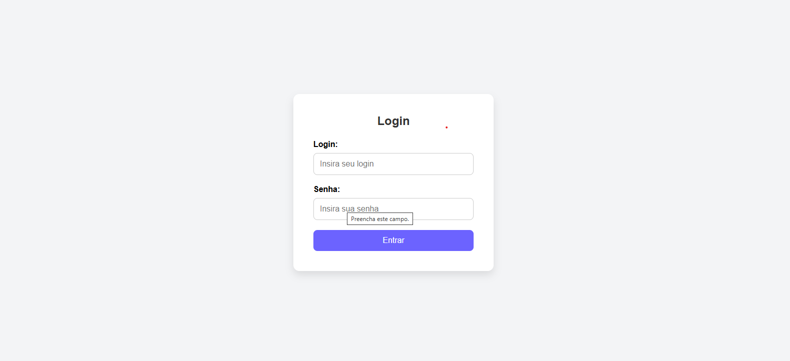
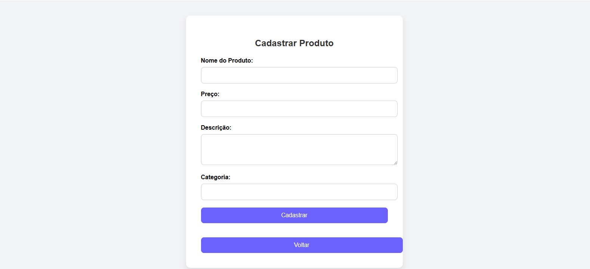
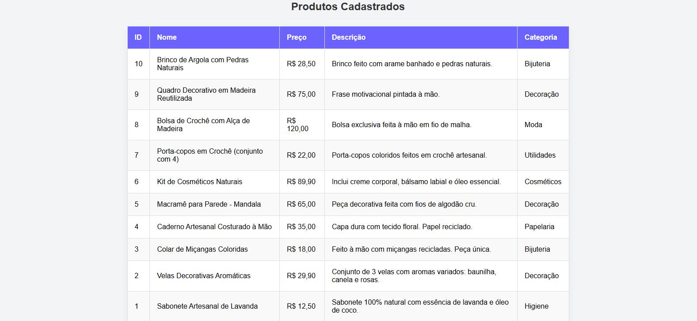
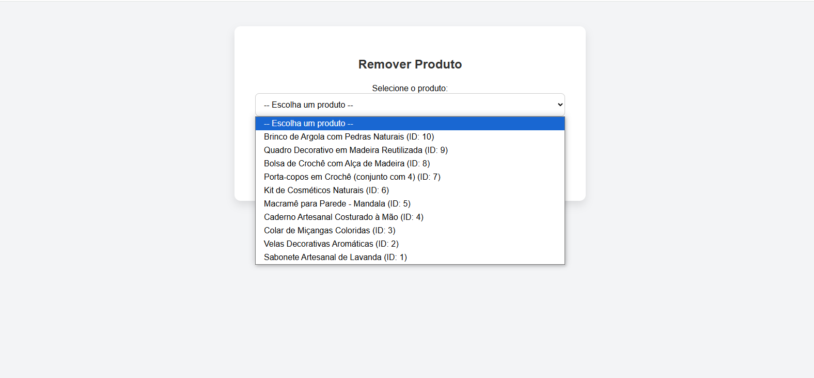

# 🧵 Lojinha Artesanal

> Sistema web simples para gerenciamento de produtos artesanais. Ideal para fins didáticos, com funcionalidades como login, cadastro, listagem e remoção de produtos.

---

## 🔐 Login de Acesso

- **Usuário:** `admin`  
- **Senha:** `admin`

> Essas credenciais estão fixas na classe `Login`, no arquivo `classes/login.php`.

---

## 🛠️ Como Rodar o Projeto

1. **Clone ou baixe o repositório:**

   ```bash
   git clone https://github.com/LemesdeMorais/FATEC_DES_WEB2_2025-_Avaliacao2/blob/main/avaliacao2_des_web.git

2. **Coloque os arquivos na pasta htdocs do XAMPP:**
    C:\xampp\htdocs\avaliacao2_des_web

3. **Inicie o Apache e o MySQL pelo XAMPP**

4. **Crie o banco de dados no MySQL:**
CREATE DATABASE artesanato_db;

USE artesanato_db;

CREATE TABLE produtos_artesanais (
    id INT AUTO_INCREMENT PRIMARY KEY,
    nome VARCHAR(255) NOT NULL,
    preco DECIMAL(10,2) NOT NULL,
    descricao TEXT NOT NULL,
    categoria VARCHAR(100) NOT NULL
);

5. **Acesse a aplicação no navegador:**
http://localhost/avaliacao2_des_web/index.php


✅ Funcionalidades
🔑 Login e controle de sessão
Sistema de autenticação simples com verificação de usuário e senha.

📷 Login:


📝 Cadastro de novos produtos: 
Permite adicionar produtos com nome, descrição, categoria e preço.

📷 Cadastro de produtos


📋 Listagem de todos os produtos:
Exibe uma tabela com todos os produtos cadastrados.

📷 Listagem dos produtos cadastrados


🗑️ Remoção de produtos:  
Permite remover um produto diretamente da listagem.

📷 Remoção de produtos cadastrados



📌 Observações
O banco de dados precisa estar corretamente configurado antes de testar o sistema.

Em caso de falhas na conexão ou execução do SQL, mensagens de erro são exibidas para facilitar o debug.

💻 Tecnologias Utilizadas
PHP

MySQL

HTML/CSS

XAMPP (ambiente local)

📄 Licença
Este projeto é apenas para fins didáticos e não possui licença aberta para uso comercial.

🤝 Contribuições
Sinta-se à vontade para fazer melhorias ou sugestões. Pull requests são bem-vindos! 😄